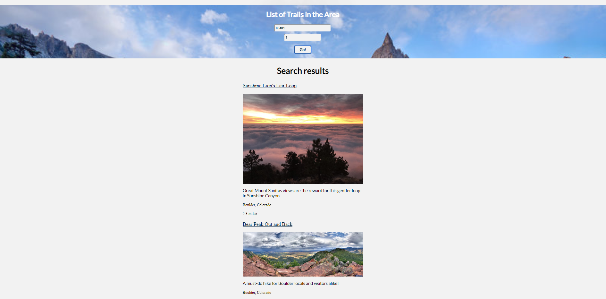
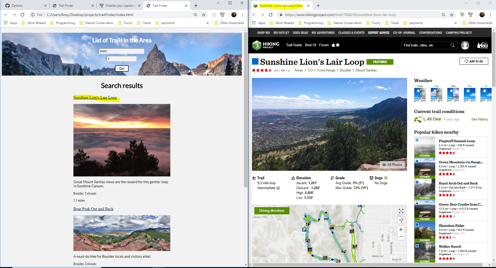

Name of Capstone: Trail Finder

Link to [Live App](https://roxyshah.github.io/trailFinder/)

Screenshot 1: User is prompted to enter a city/state or area code

Screenshot 2: User entering valid information

Screenshot 3: Search Results are displayed after the User clicks the "Go!" button

Screenshot 4: When the user clicks the link (name or image), a new window opens to that link

Summary:
The Trail Finder application will help a user search for trails in a specific area. The user can 
search for trails by either entering a city/state, or area code. From the search results 
displayed, the user can select a trail they're interested in. They will be directed to that 
trail's information in a new window.

Technologies Used:
-HTML
-CSS
-Javascript
-jQuery 

